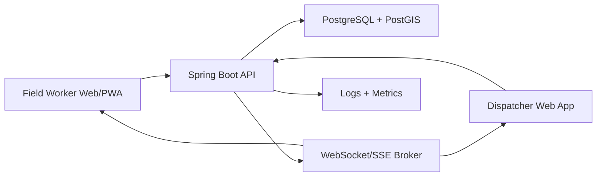
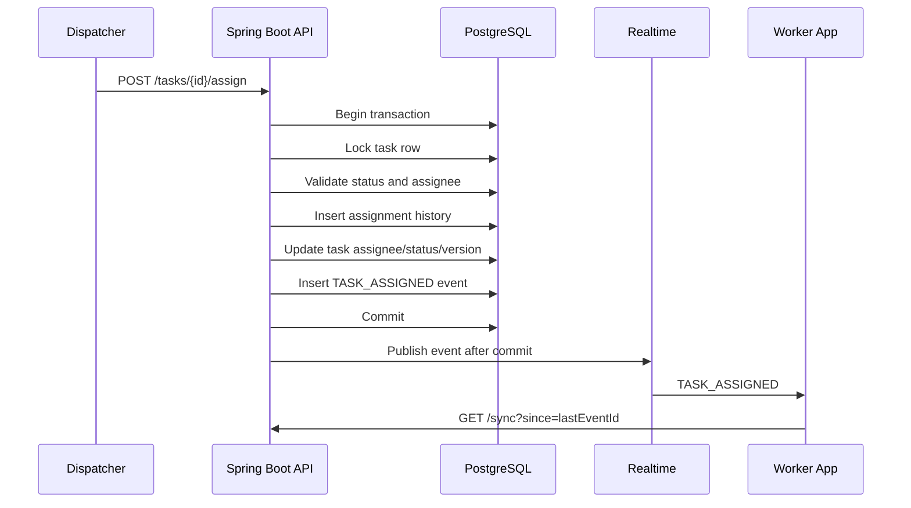
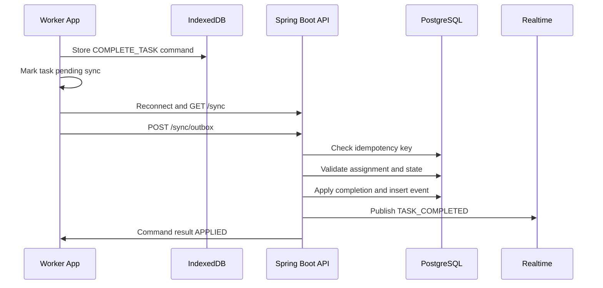

# Architecture Specification

## Architecture Decision

Build the MVP as a modular monolith with clear domain boundaries, PostgreSQL as the system of record, REST for durable APIs, and WebSocket/SSE events for live updates.

This gives the product the correctness of a single transactional backend while still leaving room to split modules later. For this domain, correctness matters more than premature service decomposition: a task should not be assigned twice, completed twice, or overwritten by stale dispatcher edits.

## System Context



## Backend Components

### API Layer

Responsibilities:

- REST controllers.
- Request validation.
- Authenticated user context.
- DTO mapping.
- OpenAPI documentation.
- Consistent error responses.

### Application Services

Responsibilities:

- Task commands.
- Assignment workflows.
- Shift workflows.
- Sync workflows.
- Authorization checks that depend on domain state.
- Transaction boundaries.

### Domain Model

Responsibilities:

- Task lifecycle state machine.
- Assignment invariants.
- Requirement validation.
- Versioned updates.
- Domain events.

### Persistence Layer

Responsibilities:

- Spring Data repositories.
- PostGIS queries.
- Optimistic locking.
- Row locks or conditional assignment updates.
- Flyway migrations.

### Realtime Publisher

Responsibilities:

- Publish task events after database commit.
- Route worker-specific events to worker topics.
- Route operational events to dispatcher topics.
- Include durable `eventId` in every message.

### Sync Service

Responsibilities:

- Return durable events after a given event ID.
- Filter events by user visibility.
- Accept offline outbox commands.
- Enforce idempotency.
- Return per-command results.

## Frontend Components

### Worker App

Responsibilities:

- Mobile-first task list.
- Map with assigned tasks.
- Active shift workflow.
- Task detail and completion flow.
- IndexedDB offline cache.
- Offline outbox.
- Reconnect sync and replay.

### Dispatcher App

Responsibilities:

- Task creation and editing.
- Assignment and reassignment.
- City map overview.
- Worker/task monitoring.
- Live updates.
- Conflict handling for stale edits.

### Shared Frontend Services

Responsibilities:

- API client.
- Auth token handling.
- Query cache.
- WebSocket/SSE connection.
- IndexedDB persistence.
- Error normalization.

## "Uber for Tasks" Dispatch Model

The product should behave like a lightweight dispatch marketplace, but with controlled assignment rather than fully open bidding for the MVP.

MVP model:

- Dispatchers create tasks.
- Tasks enter an `OPEN` pool.
- Dispatchers or simple automation assign tasks to workers.
- Workers receive live assignment notifications.
- Workers execute tasks in suggested route order.
- Dispatchers monitor progress and rebalance work manually.

Later model:

- Auto-assignment suggests the best worker based on distance, active shift, current workload, task priority, required skills, and due time.
- Workers can accept or reject suggested tasks if the business process allows it.
- Dispatchers can override automation.
- Assignment engine learns from completion duration and travel patterns.

MVP assignment scoring can start simple:

```text
score = priorityWeight + dueSoonWeight - distancePenalty - workloadPenalty
```

Inputs:

- Worker current or last known location.
- Worker active shift status.
- Worker assigned active task count.
- Task priority.
- Task due time.
- Distance to task.
- Required capability, if introduced later.

The assignment engine should be a backend service inside the modular monolith first. It can become a separate optimization service later if it grows complex.

## Data Flow: Task Assignment



## Data Flow: Offline Completion



## Deployment View

MVP deployment:

- Frontend static assets served by CDN or Nginx container.
- Spring Boot API container.
- PostgreSQL/PostGIS database.
- Optional Redis later for rate limiting, distributed locks, or pub/sub if multiple API instances are deployed.

For a single backend instance, in-process WebSocket publishing is acceptable. For multiple instances, use a shared broker or database-backed event relay so socket clients connected to different instances receive the same events.

## Scaling Path

Phase 1:

- Single Spring Boot API instance.
- PostgreSQL/PostGIS.
- In-process realtime publishing.

Phase 2:

- Multiple API instances behind a load balancer.
- Redis or message broker for realtime fanout.
- Sticky sessions or broker-backed WebSocket routing.

Phase 3:

- Extract assignment optimization if route planning becomes CPU-heavy.
- Extract media upload processing if proof photos/videos become large.
- Add push notification service.

## Key Architectural Rules

- PostgreSQL is the source of truth.
- REST commands are durable and authoritative.
- WebSocket/SSE messages are hints, not the only delivery mechanism.
- Every important business event is persisted.
- Assignment and task lifecycle validation happen server-side.
- Offline commands must be idempotent.
- Sync must be event-ID based.
- Route optimization starts simple and evolves behind a stable API.
