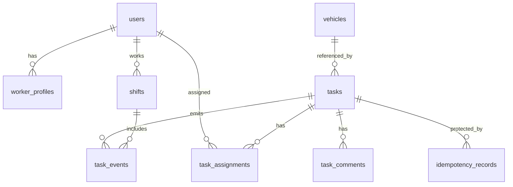

# Data Model

## Design Principles

- Use UUID or ULID identifiers for externally visible IDs.
- Use PostgreSQL `bigserial` event IDs for ordered sync streams.
- Store geospatial task and vehicle coordinates using PostGIS `geography(Point, 4326)` when available.
- Add `version` columns to mutable aggregate roots.
- Keep immutable audit events separate from mutable task rows.
- Use soft cancellation/status changes for business records rather than hard deletes.

## Entity Overview

## Tables

### `users`

| Column | Type | Notes |
| --- | --- | --- |
| `id` | uuid | Primary key |
| `email` | text | Unique, normalized lowercase |
| `password_hash` | text | BCrypt/Argon2 hash |
| `name` | text | Display name |
| `status` | text | `ACTIVE`, `DISABLED` |
| `roles` | text[] | MVP option; normalize later if needed |
| `created_at` | timestamptz | Required |
| `updated_at` | timestamptz | Required |

Indexes:

- Unique index on `email`.

### `worker_profiles`

| Column | Type | Notes |
| --- | --- | --- |
| `id` | uuid | Primary key |
| `user_id` | uuid | Unique FK to `users` |
| `home_base_name` | text | Optional |
| `active` | boolean | Whether worker can receive tasks |
| `created_at` | timestamptz | Required |
| `updated_at` | timestamptz | Required |

### `vehicles`

| Column | Type | Notes |
| --- | --- | --- |
| `id` | uuid | Primary key |
| `external_code` | text | Unique vehicle code or QR code |
| `vehicle_type` | text | Scooter, bike, car, etc. |
| `status` | text | `AVAILABLE`, `NEEDS_SERVICE`, `IN_TRANSIT`, `WAREHOUSE` |
| `battery_level` | integer | 0 to 100, nullable |
| `last_known_location` | geography(Point, 4326) | Nullable |
| `last_seen_at` | timestamptz | Nullable |
| `version` | bigint | Optimistic locking |
| `created_at` | timestamptz | Required |
| `updated_at` | timestamptz | Required |

Indexes:

- Unique index on `external_code`.
- GiST index on `last_known_location`.

### `tasks`

| Column | Type | Notes |
| --- | --- | --- |
| `id` | uuid | Primary key |
| `vehicle_id` | uuid | Nullable FK to `vehicles` |
| `type` | text | Task type |
| `status` | text | Lifecycle status |
| `priority` | text | `LOW`, `NORMAL`, `HIGH`, `URGENT` |
| `title` | text | Short worker-facing text |
| `description` | text | Detailed instructions |
| `requirements` | jsonb | Checklist/requirements |
| `location` | geography(Point, 4326) | Required |
| `address` | text | Human-readable address |
| `due_at` | timestamptz | Nullable |
| `assignee_id` | uuid | Nullable FK to `users`; denormalized current assignee |
| `assigned_at` | timestamptz | Nullable |
| `started_at` | timestamptz | Nullable |
| `completed_at` | timestamptz | Nullable |
| `blocked_at` | timestamptz | Nullable |
| `cancelled_at` | timestamptz | Nullable |
| `version` | bigint | Optimistic locking |
| `created_by` | uuid | FK to `users` |
| `created_at` | timestamptz | Required |
| `updated_at` | timestamptz | Required |

Indexes:

- B-tree index on `status`.
- B-tree index on `assignee_id`.
- B-tree index on `(assignee_id, status)`.
- B-tree index on `(priority, due_at)`.
- GiST index on `location`.
- Partial index for open work: `(priority, due_at) WHERE status IN ('OPEN', 'ASSIGNED', 'IN_PROGRESS', 'BLOCKED')`.

Status values:

- `OPEN`
- `ASSIGNED`
- `IN_PROGRESS`
- `BLOCKED`
- `COMPLETED`
- `CANCELLED`

Task type values:

- `SWAP_BATTERY`
- `QUALITY_CHECK`
- `MOVE_VEHICLE`
- `RETURN_TO_WAREHOUSE`
- `INSPECT_DAMAGE`

### `task_assignments`

Historical assignment records.

| Column | Type | Notes |
| --- | --- | --- |
| `id` | uuid | Primary key |
| `task_id` | uuid | FK to `tasks` |
| `worker_id` | uuid | FK to `users` |
| `assigned_by` | uuid | FK to `users` |
| `assigned_at` | timestamptz | Required |
| `unassigned_at` | timestamptz | Nullable |
| `unassigned_by` | uuid | Nullable FK to `users` |
| `unassign_reason` | text | Nullable |

Indexes:

- Index on `task_id`.
- Index on `(worker_id, assigned_at)`.
- Partial unique index on `task_id WHERE unassigned_at IS NULL`.

### `shifts`

| Column | Type | Notes |
| --- | --- | --- |
| `id` | uuid | Primary key |
| `worker_id` | uuid | FK to `users` |
| `status` | text | `ACTIVE`, `ENDED` |
| `started_at` | timestamptz | Required |
| `ended_at` | timestamptz | Nullable |
| `start_location` | geography(Point, 4326) | Nullable |
| `end_location` | geography(Point, 4326) | Nullable |
| `created_at` | timestamptz | Required |
| `updated_at` | timestamptz | Required |

Indexes:

- Partial unique index on `worker_id WHERE status = 'ACTIVE'`.

### `task_comments`

| Column | Type | Notes |
| --- | --- | --- |
| `id` | uuid | Primary key |
| `task_id` | uuid | FK to `tasks` |
| `author_id` | uuid | FK to `users` |
| `body` | text | Required |
| `created_at` | timestamptz | Required |

Indexes:

- Index on `(task_id, created_at)`.

### `task_events`

Durable event stream for audit, realtime publishing, and sync.

| Column | Type | Notes |
| --- | --- | --- |
| `event_id` | bigserial | Primary ordered sync ID |
| `task_id` | uuid | FK to `tasks` |
| `type` | text | Event type |
| `actor_id` | uuid | Nullable FK to `users` |
| `shift_id` | uuid | Nullable FK to `shifts` |
| `entity_version` | bigint | Task version after event |
| `payload` | jsonb | Event-specific details |
| `occurred_at` | timestamptz | Required |

Indexes:

- Index on `task_id`.
- Index on `occurred_at`.
- Index on `(event_id)`.

Event types:

- `TASK_CREATED`
- `TASK_UPDATED`
- `TASK_ASSIGNED`
- `TASK_UNASSIGNED`
- `TASK_STARTED`
- `TASK_COMPLETED`
- `TASK_BLOCKED`
- `TASK_CANCELLED`
- `TASK_COMMENT_ADDED`

### `idempotency_records`

| Column | Type | Notes |
| --- | --- | --- |
| `id` | uuid | Primary key |
| `idempotency_key` | text | Required |
| `user_id` | uuid | FK to `users` |
| `command_type` | text | Example: `COMPLETE_TASK` |
| `request_hash` | text | Hash of submitted payload |
| `response_body` | jsonb | Original response |
| `status_code` | integer | Original status |
| `created_at` | timestamptz | Required |
| `expires_at` | timestamptz | Required |

Indexes:

- Unique index on `(user_id, idempotency_key)`.
- Index on `expires_at` for cleanup.

## State Transitions

Allowed task transitions:

- `OPEN -> ASSIGNED`
- `ASSIGNED -> OPEN`
- `ASSIGNED -> IN_PROGRESS`
- `ASSIGNED -> BLOCKED`
- `IN_PROGRESS -> BLOCKED`
- `IN_PROGRESS -> COMPLETED`
- `BLOCKED -> ASSIGNED`
- `BLOCKED -> CANCELLED`
- `OPEN -> CANCELLED`
- `ASSIGNED -> CANCELLED`

Disallowed:

- `COMPLETED -> any other status`
- assignment to multiple active workers
- worker command by a user who is not the assignee

## Concurrency Rules

Optimistic locking:

- `tasks.version` increments on every task mutation.
- `vehicles.version` increments on every vehicle mutation.
- Stale `If-Match` updates return `409 Conflict`.

Atomic assignment:

- Assignment writes must happen in one database transaction.
- Current task row and active assignment invariant must be protected by conditional update, row lock, or partial unique index.

Idempotent commands:

- Replayed command with same `user_id` and `idempotency_key` returns stored result.
- Same key with different payload hash returns `409 Conflict`.

## Sync Model

The client stores the latest seen `task_events.event_id`.

On reconnect:

1. Client sends `GET /api/v1/sync?since=<eventId>`.
2. Server returns events visible to that user.
3. Client applies events in ascending `event_id` order.
4. Client replays local outbox commands.
5. Client performs a final refresh for active task list.

Visibility rules:

- Field workers receive events for tasks currently or previously assigned to them during the relevant sync window.
- Dispatchers receive all task events in their city/tenant.
- Admins receive all permitted tenant events.
