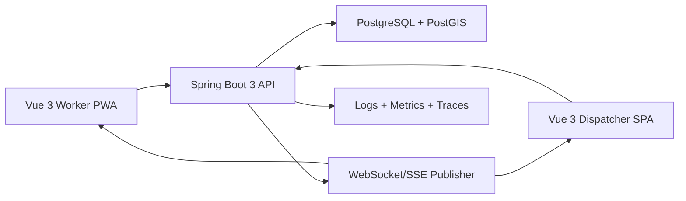

# Reviewed Architecture

## Decision

Build the MVP as a **Spring Boot 3 modular monolith** with PostgreSQL/PostGIS as the source of truth, REST for durable APIs, and WebSocket/SSE for live notifications.

This is the best architecture for the first production version because the hardest problems are correctness problems:

- do not assign the same task to two workers
- do not overwrite a dispatcher's task changes with stale data
- do not lose offline worker actions
- do not trust missed WebSocket messages as durable delivery

The application should be internally modular so it can later split into services if routing, assignment optimization, media handling, or notifications become independently scalable concerns.

## System Context



## Backend Modules

Use domain-oriented modules inside one deployable Spring Boot application:

- `identity`: users, roles, authentication, refresh tokens.
- `workers`: worker profiles, availability, location pings.
- `shifts`: active shifts, start/end, shift summaries.
- `vehicles`: vehicle metadata and latest known location/status.
- `tasks`: task lifecycle, comments, requirements, completion.
- `assignments`: assignment history and assignment invariants.
- `dispatch`: dispatcher views, assignment scoring, route suggestions.
- `sync`: event-id sync, offline outbox replay, idempotency.
- `realtime`: WebSocket/SSE event fanout after commit.
- `audit`: durable task event stream.

## REST vs GraphQL

Use **REST** for the MVP.

REST is better here because:

- resources are clear and shallow: tasks, workers, shifts, vehicles
- commands map cleanly to endpoints
- offline replay is easier with idempotent command endpoints
- OpenAPI gives a simple backend/frontend contract
- endpoint-level authorization and observability are straightforward
- WebSocket/SSE covers live updates without GraphQL subscriptions

Revisit GraphQL only if dispatcher analytics becomes a highly customizable reporting surface that repeatedly overfetches through REST.

## Realtime Reliability

Realtime messages are **notifications**, not the source of truth.

The durable flow is:

1. Validate command.
2. Mutate database in a transaction.
3. Insert a `task_events` row with a monotonic `event_id`.
4. Commit.
5. Publish a WebSocket/SSE event after commit.
6. Client stores latest `event_id`.
7. Client calls `/api/v1/sync?since=<eventId>` after reconnect.

Every realtime event must include:

- `eventId`
- `type`
- `entityType`
- `entityId`
- `version`
- `occurredAt`
- `payload`

## "Uber for Tasks" Dispatch Model

MVP dispatch is controlled assignment:

- Dispatchers create tasks into an open task pool.
- Dispatchers assign tasks manually or with simple suggestions.
- Workers receive live assignment notifications.
- Workers execute assigned tasks in suggested route order.
- Dispatchers rebalance manually during the shift.

Later assignment scoring can use:

```text
score = priorityWeight + dueSoonWeight - distancePenalty - workloadPenalty
```

Inputs:

- worker active shift status
- worker last known location
- current active task count
- task priority
- task due time
- distance to task
- required skill/capability, if added later

Keep the assignment engine inside the monolith first. Extract it only if optimization becomes complex or CPU-heavy.

## Deployment Path

MVP:

- Vue static assets served by CDN or Nginx.
- One Spring Boot API container.
- PostgreSQL/PostGIS.
- Optional Redis only for rate limiting, pub/sub fanout, or future distributed coordination.

Scale-up:

- Multiple API instances behind load balancer.
- Broker-backed realtime fanout.
- Database-backed event relay or message broker for after-commit publishing.
- Separate media service for large proof uploads.
- Separate optimization service only when needed.

## Architectural Rules

- PostgreSQL is the source of truth.
- REST commands are authoritative.
- WebSocket/SSE is best-effort notification only.
- Sync is event-ID based, not timestamp-only.
- Offline worker commands are idempotent.
- Assignment is protected by database transaction and constraints.
- Realtime publication happens after commit.
- Frontend uses Pinia for client state and Vue Query for server state.
